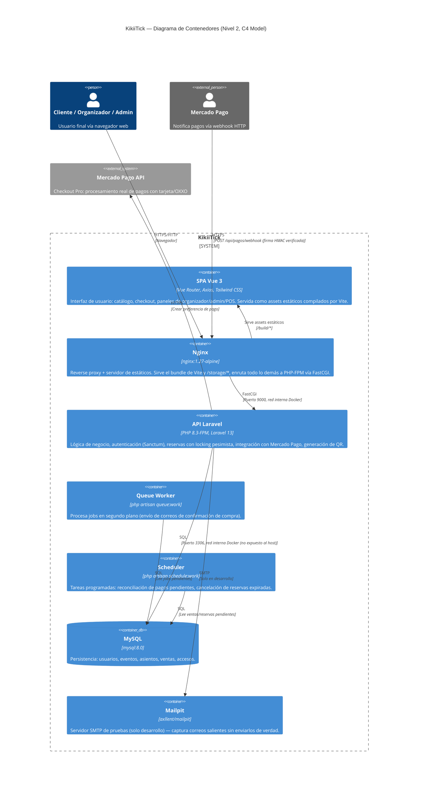

# KikiiTick

Plataforma de venta de boletos para eventos en vivo (conciertos, teatro, deportes) con selección interactiva de asientos, checkout con Mercado Pago (tarjeta/OXXO), y venta directa en taquilla física (POS). Backend en **Laravel 13** (PHP 8.3), frontend **Vue 3** (SPA con Vue Router), base de datos **MySQL 8.0**, todo orquestado con **Docker Compose**.

---

## Tabla de contenidos

- [Prerrequisitos](#prerrequisitos)
- [Guía de inicio rápido](#guía-de-inicio-rápido)
- [Arquitectura (Diagrama de Contenedores C4)](#arquitectura-diagrama-de-contenedores-c4)
- [Servicios de Docker Compose](#servicios-de-docker-compose)
- [Ejecutar la suite de tests](#ejecutar-la-suite-de-tests)
- [Análisis estático (PHPStan / Larastan)](#análisis-estático-phpstan--larastan)
- [Documentación de la API](#documentación-de-la-api)
- [Auditoría y logs de seguridad](#auditoría-y-logs-de-seguridad)
- [Estructura del proyecto](#estructura-del-proyecto)

---

## Prerrequisitos

- [Docker Desktop](https://www.docker.com/products/docker-desktop/) (o Docker Engine + Docker Compose v2 en Linux)
- [Git](https://git-scm.com/)

No se requiere PHP, Composer, Node ni MySQL instalados localmente — todo corre dentro de los contenedores.

---

## Guía de inicio rápido

```bash
# 1. Clonar el repositorio
git clone <url-del-repositorio> kikiitick
cd kikiitick

# 2. Configurar el entorno
cp .env.example .env
# Edita .env: como mínimo define APP_KEY (paso 4), y las credenciales de
# Mercado Pago si vas a probar el flujo de pagos (MERCADOPAGO_ACCESS_TOKEN,
# MERCADOPAGO_PUBLIC_KEY, MERCADOPAGO_WEBHOOK_SECRET).

# 3. Levantar los contenedores (build + arranque)
docker compose up -d --build

# 4. Generar la clave de aplicación (si .env.example no trae una ya)
docker compose exec app php artisan key:generate

# 5. Ejecutar las migraciones
docker compose exec app php artisan migrate --force

# 6. (Opcional) Poblar datos de ejemplo
docker compose exec app php artisan db:seed

# 7. Limpiar cachés tras cualquier cambio de configuración
docker compose exec app php artisan config:clear
docker compose exec app php artisan route:clear
docker compose exec app php artisan view:clear
docker compose exec app php artisan cache:clear
```

La aplicación queda disponible en **http://localhost** (servida por Nginx). El panel de correos de prueba (Mailpit) queda en **http://localhost:8025**.

### Reconstruir después de cambiar código PHP o Vue

El código de la aplicación se hornea dentro de la imagen en build time (no hay bind-mount de `app/`/`resources/`) — cualquier cambio requiere reconstruir:

```bash
docker compose build app
```

> ⚠️ **Importante:** `public/` es un volumen Docker con nombre (`app-public`), y Docker solo lo siembra desde la imagen la **primera vez** que se crea — reconstruir la imagen NO actualiza por sí solo los assets ya servidos. Si tras un `docker compose build app` los cambios de frontend no se reflejan en el navegador, hay que recrear el volumen:
>
> ```bash
> docker compose stop app web queue-worker scheduler
> docker compose rm -f app web queue-worker scheduler
> docker volume rm kikiitick_app-public
> docker compose up -d app web queue-worker scheduler
> ```

---

## Arquitectura (Diagrama de Contenedores C4)



**Notas de la arquitectura:**
- `mysql` **no expone su puerto al host** — solo es alcanzable desde `app`/`queue-worker`/`scheduler` dentro de la red interna `kikiitick-net`, reduciendo la superficie de ataque.
- El código de la SPA se compila en un stage de build separado (`node:20-alpine`) y solo el `public/build/` resultante se copia a la imagen final — el `node_modules` de desarrollo nunca llega a producción.
- `queue-worker` y `scheduler` corren la **misma imagen** que `app`, solo cambia el comando (`CMD`) — evita duplicar la etapa de build de Composer/npm.

---

## Servicios de Docker Compose

| Servicio | Imagen | Rol |
|---|---|---|
| `mysql` | `mysql:8.0` | Base de datos (sin puerto expuesto al host) |
| `mailpit` | `axllent/mailpit` | Captura de correos en desarrollo (UI en `:8025`) |
| `app` | build propio (multi-stage) | PHP-FPM 8.3, procesa `/api/*` y sirve el shell de la SPA |
| `queue-worker` | misma imagen que `app` | `php artisan queue:work` |
| `scheduler` | misma imagen que `app` | `php artisan schedule:work` |
| `web` | `nginx:1.27-alpine` | Reverse proxy, único puerto expuesto (`:80`) |

---

## Ejecutar la suite de tests

```bash
docker compose exec app php artisan test
```

> **Nota técnica:** la imagen `app` es un build de **producción** (`composer install --no-dev`), así que no incluye PHPUnit. Para correr los tests hay que instalar las dependencias de desarrollo primero (o usar un contenedor PHP efímero con las dependencias del `composer.json` completo — ver `.github/workflows/ci.yml` para el pipeline de referencia usado en CI). La suite usa **SQLite en memoria** (`phpunit.xml`), completamente aislada de la base de datos real — es seguro correrla en cualquier momento sin riesgo de tocar datos reales.

## Análisis estático (PHPStan / Larastan)

```bash
./vendor/bin/phpstan analyse --level=1 app
```

Configurado en `phpstan.neon` (nivel 1, con `larastan/larastan` para reglas específicas de Eloquent/Laravel). `phpstan-baseline.neon` congela 24 falsos positivos conocidos de la regla `relationExistence` (requiere anotaciones `@return` nativas en los métodos de relación, que el código actual no tiene) — el CI falla ante hallazgos **nuevos**, no ante estos ya documentados.

---

## Documentación de la API

- **Colección Postman:** [`KikiiTick_API_Postman.json`](./KikiiTick_API_Postman.json) — endpoints de autenticación, recintos, eventos y mapa de asientos, con ejemplos de request/response y códigos HTTP estándar (200, 201, 401, 403, 404, 422).
- Autenticación basada en **cookies de sesión Sanctum** (SPA), no en Bearer tokens: hay que pedir `GET /sanctum/csrf-cookie` antes de cualquier request autenticado y reenviar el header `X-XSRF-TOKEN`.
- Rutas públicas principales: `GET /api/eventos`, `GET /api/eventos/{id}/mapa`.
- Rutas protegidas por rol: `/api/organizador/*` (organizador aprobado o admin), `/api/admin/*` (admin).

---

## Auditoría y logs de seguridad

Los eventos de autenticación (login exitoso, login fallido, logout) se registran en un canal de log dedicado, separado de `laravel.log`:

```
storage/logs/auditoria.log       # rotación diaria, retención de 90 días
```

Configurado en `config/logging.php` (canal `auditoria`) y emitido desde `AuthController`.

---

## Estructura del proyecto

```
app/
├── Http/Controllers/    # Controladores delgados — delegan a Services
├── Models/               # Modelos Eloquent
├── Services/             # Lógica de negocio (CompraService, SeatGeneratorService, MercadoPagoService...)
├── Console/Commands/     # Comandos programados (reconciliación de pagos, cancelación de reservas)
└── Http/Middleware/      # Autorización por rol, cabeceras de seguridad

resources/js/
├── Views/                # Páginas de la SPA (Home, Checkout, Organizador, Admin, POS...)
├── Components/           # Componentes reutilizables (Navbar, modales)
└── composables/          # Estado compartido (auth, modales)

database/
├── migrations/
└── seeders/

docker/                   # Configuración de Nginx y entrypoint de PHP
tests/Feature/            # Suite de tests automatizados (Pest/PHPUnit)
```
